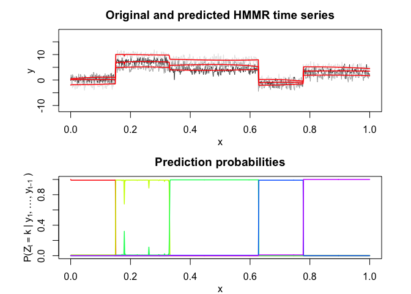
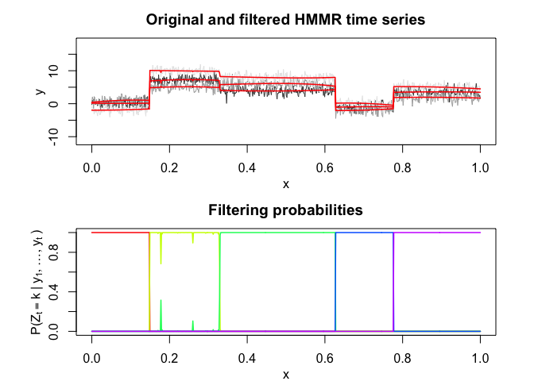

<!-- README.md is generated from README.Rmd. Please edit that file -->

## Overview

<!-- badges: start -->

<!-- badges: end -->

Multiple Hidden Markov Model Regression (HMMR) for the **segmentation**
of multivariate time series with regime changes.

The model assumes that the time series is governed by a sequence of
hidden discrete regimes/states, where each regime/state has multivariate
Gaussian regressors emission densities. The model parameters are
estimated by MLE via the EM algorithm.

## Installation

You can install the development version of MHMMR from
[GitHub](https://github.com/) with:

``` r
# install.packages("devtools")
devtools::install_github("fchamroukhi/MHMMR")
```

To build *vignettes* for examples of usage, type the command below
instead:

``` r
# install.packages("devtools")
devtools::install_github("fchamroukhi/MHMMR", 
                         build_opts = c("--no-resave-data", "--no-manual"), 
                         build_vignettes = TRUE)
```

Use the following command to display vignettes:

``` r
browseVignettes("MHMMR")
```

## Usage

``` r
library(MHMMR)

data("simulatedtimeseries")
fData <- FData$new()
fData$setData(simulatedtimeseries$X, simulatedtimeseries[, 2:ncol(simulatedtimeseries)])

K <- 5 # Number of regimes (states)
p <- 3 # Dimension of beta (order of the polynomial regressors)
variance_type <- variance_types$hetereskedastic
modelMHMMR <- ModelMHMMR(fData, K, p, variance_type)

n_tries <- 1
max_iter <- 1500
threshold <- 1e-6
verbose <- TRUE

solution <- EM(modelMHMMR, n_tries, max_iter, threshold, verbose)
#> [1] "HMM_regression | EM   : Iteration : 1  Log-likelihood :  -4425.29307889945"
#> [1] "HMM_regression | EM   : Iteration : 2  Log-likelihood :  -2876.80418310609"
#> [1] "HMM_regression | EM   : Iteration : 3  Log-likelihood :  -2876.69073409991"
#> [1] "HMM_regression | EM   : Iteration : 4  Log-likelihood :  -2876.69055273039"

solution$plot()
```


