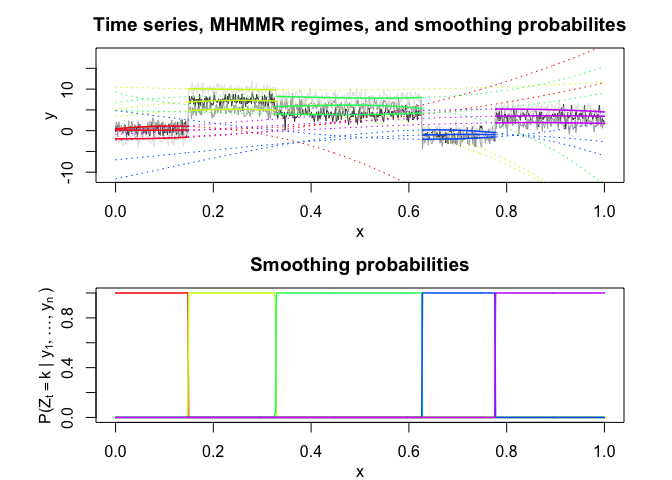

<!-- README.md is generated from README.Rmd. Please edit that file -->

<!-- badges: start -->

<!-- badges: end -->

## Overview

Multiple Hidden Markov Model Regression (HMMR) for the **segmentation**
of multivariate time series with regime changes.

The model assumes that the time series is governed by a sequence of
hidden discrete regimes/states, where each regime/state has multivariate
Gaussian regressors emission densities. The model parameters are
estimated by MLE via the EM algorithm.

## Installation

You can install the development version of MHMMR from
[GitHub](https://github.com/) with:

``` r
# install.packages("devtools")
devtools::install_github("fchamroukhi/MHMMR")
```

To build *vignettes* for examples of usage, type the command below
instead:

``` r
# install.packages("devtools")
devtools::install_github("fchamroukhi/MHMMR", 
                         build_opts = c("--no-resave-data", "--no-manual"), 
                         build_vignettes = TRUE)
```

Use the following command to display vignettes:

``` r
browseVignettes("MHMMR")
```

## Usage

``` r
library(MHMMR)

data("toydataset")

K <- 5 # Number of regimes (states)
p <- 3 # Dimension of beta (order of the polynomial regressors)
variance_type <- "heteroskedastic" # "heteroskedastic" or "homoskedastic" model

n_tries <- 1
max_iter <- 1500
threshold <- 1e-6
verbose <- TRUE

mhmmr <- emMHMMR(toydataset$x, toydataset[, c("y1", "y2", "y3")],
                 K, p, variance_type, n_tries, max_iter, threshold, verbose)
#> EM: Iteration : 1 || log-likelihood : -4425.29307889945
#> EM: Iteration : 2 || log-likelihood : -2876.80418310609
#> EM: Iteration : 3 || log-likelihood : -2876.69073409991
#> EM: Iteration : 4 || log-likelihood : -2876.69055273039

mhmmr$summary()
#> ----------------------
#> Fitted MHMMR model
#> ----------------------
#> 
#> MHMMR model with K = 5 regimes
#> 
#>  log-likelihood  nu       AIC       BIC
#>       -2876.691 114 -2990.691 -3247.605
#> 
#> Clustering table:
#>   1   2   3   4   5 
#> 100 120 200 100 150 
#> 
#> 
#> ------------------
#> Regime 1 (K = 1):
#> 
#> Regression coefficients:
#> 
#>     Beta(d = 1) Beta(d = 2) Beta(d = 3)
#> 1     0.1595884   0.4201364  -1.9684451
#> X^1  -1.7145325  11.7544140  -0.3006142
#> X^2  10.6877091 -50.1877444  18.6445441
#> X^3   2.3981783 -11.3098522   4.1479356
#> 
#> Covariance matrix:
#>                                    
#>  1.19029438  0.12929675  0.05476253
#>  0.12929675  0.86375075 -0.04927306
#>  0.05476253 -0.04927306  0.87780108
#> ------------------
#> Regime 2 (K = 2):
#> 
#> Regression coefficients:
#> 
#>     Beta(d = 1) Beta(d = 2) Beta(d = 3)
#> 1       5.15889     3.33862   10.451892
#> X^1    15.56177    13.57089   -2.723323
#> X^2   -23.21384   -21.11255    1.987222
#> X^3   -19.14783   -17.33469    2.005997
#> 
#> Covariance matrix:
#>                                   
#>   1.0610207 -0.18930477 0.12778054
#>  -0.1893048  1.04687322 0.01497034
#>   0.1277805  0.01497034 0.76036609
#> ------------------
#> Regime 3 (K = 3):
#> 
#> Regression coefficients:
#> 
#>     Beta(d = 1) Beta(d = 2) Beta(d = 3)
#> 1      4.795937    9.292094    6.795783
#> X^1   -1.263151  -32.958041   15.068148
#> X^2   -7.837624   96.000594  -45.446277
#> X^3   13.420270  -85.462348   38.987695
#> 
#> Covariance matrix:
#>                                     
#>   1.02087804 -0.04142857 -0.02435233
#>  -0.04142857  1.15623166  0.02795799
#>  -0.02435233  0.02795799  0.99869029
#> ------------------
#> Regime 4 (K = 4):
#> 
#> Regression coefficients:
#> 
#>     Beta(d = 1) Beta(d = 2) Beta(d = 3)
#> 1     -7.021181    4.833214  -11.605950
#> X^1   11.317211  -15.023656   24.674451
#> X^2    3.910821   -3.672965    6.844172
#> X^3  -10.872747   16.089951  -25.976569
#> 
#> Covariance matrix:
#>                                     
#>   0.87900680 -0.03091285 -0.03661533
#>  -0.03091285  1.11837399 -0.07481527
#>  -0.03661533 -0.07481527  0.85426254
#> ------------------
#> Regime 5 (K = 5):
#> 
#> Regression coefficients:
#> 
#>     Beta(d = 1) Beta(d = 2) Beta(d = 3)
#> 1    -0.8791755   -2.313216 -0.09479267
#> X^1   5.9187901    5.861810  8.23344181
#> X^2   3.5548127    3.717845  4.33488866
#> X^3  -5.1244038   -5.553392 -7.97025598
#> 
#> Covariance matrix:
#>                                  
#>  1.13188125 0.25712861 0.02924967
#>  0.25712861 1.21059097 0.04483453
#>  0.02924967 0.04483453 0.79846413

mhmmr$plot()
```


