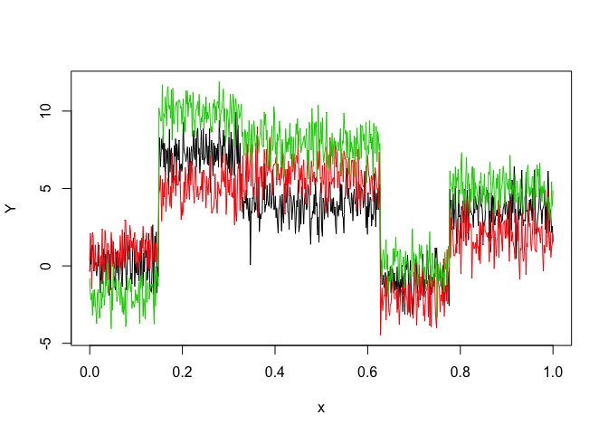

<!-- README.md is generated from README.Rmd. Please edit that file -->

<!-- badges: start -->

<!-- badges: end -->

# Overview

Multiple Hidden Markov Model Regression (HMMR) for the **segmentation**
of multivariate time series with regime changes.

The model assumes that the time series is governed by a sequence of
hidden discrete regimes/states, where each regime/state has multivariate
Gaussian regressors emission densities. The model parameters are
estimated by MLE via the EM algorithm.

# Installation

You can install the development version of MHMMR from
[GitHub](https://github.com/) with:

``` r
# install.packages("devtools")
devtools::install_github("fchamroukhi/MHMMR")
```

To build *vignettes* for examples of usage, type the command below
instead:

``` r
# install.packages("devtools")
devtools::install_github("fchamroukhi/MHMMR", 
                         build_opts = c("--no-resave-data", "--no-manual"), 
                         build_vignettes = TRUE)
```

Use the following command to display vignettes:

``` r
browseVignettes("MHMMR")
```

# Usage

``` r
library(MHMMR)
```

``` r
# Application to a simulated data set
data("toydataset")
x <- toydataset$x
y <- toydataset[, c("y1", "y2", "y3")]

K <- 5 # Number of regimes (states)
p <- 1 # Dimension of beta (order of the polynomial regressors)
variance_type <- "heteroskedastic" # "heteroskedastic" or "homoskedastic" model

n_tries <- 1
max_iter <- 1500
threshold <- 1e-6
verbose <- TRUE

mhmmr <- emMHMMR(X = x, Y = y, K, p, variance_type, n_tries, 
                 max_iter, threshold, verbose)
#> EM - MHMMR: Iteration: 1 | log-likelihood: -4539.37845473736
#> EM - MHMMR: Iteration: 2 | log-likelihood: -3075.7862970485
#> EM - MHMMR: Iteration: 3 | log-likelihood: -2904.71126233611
#> EM - MHMMR: Iteration: 4 | log-likelihood: -2883.23456594806
#> EM - MHMMR: Iteration: 5 | log-likelihood: -2883.12446634454
#> EM - MHMMR: Iteration: 6 | log-likelihood: -2883.12436399888

mhmmr$summary()
#> ----------------------
#> Fitted MHMMR model
#> ----------------------
#> 
#> MHMMR model with K = 5 regimes
#> 
#>  log-likelihood nu       AIC      BIC
#>       -2883.124 84 -2967.124 -3156.43
#> 
#> Clustering table:
#>   1   2   3   4   5 
#> 100 120 200 100 150 
#> 
#> 
#> ------------------
#> Regime 1 (k = 1):
#> 
#> Regression coefficients:
#> 
#>     Beta(d = 1) Beta(d = 2) Beta(d = 3)
#> 1    0.11943184   0.6087582   -2.038486
#> X^1 -0.08556857   4.1038126    2.540536
#> 
#> Covariance matrix:
#>                                    
#>  1.19064336  0.12765794  0.05537134
#>  0.12765794  0.87145062 -0.05213162
#>  0.05537134 -0.05213162  0.87886166
#> ------------------
#> Regime 2 (k = 2):
#> 
#> Regression coefficients:
#> 
#>     Beta(d = 1) Beta(d = 2) Beta(d = 3)
#> 1      6.921139   4.9377164   10.290536
#> X^1    1.131946   0.4684922   -1.419758
#> 
#> Covariance matrix:
#>                                   
#>   1.0688949 -0.18240787 0.12675972
#>  -0.1824079  1.05317924 0.01419686
#>   0.1267597  0.01419686 0.76030310
#> ------------------
#> Regime 3 (k = 3):
#> 
#> Regression coefficients:
#> 
#>     Beta(d = 1) Beta(d = 2) Beta(d = 3)
#> 1     3.6576562   6.3642526    8.493765
#> X^1   0.6155173  -0.8844373   -1.137027
#> 
#> Covariance matrix:
#>                                     
#>   1.02647251 -0.05491451 -0.01930098
#>  -0.05491451  1.18921808  0.01510035
#>  -0.01930098  0.01510035  1.00352482
#> ------------------
#> Regime 4 (k = 4):
#> 
#> Regression coefficients:
#> 
#>     Beta(d = 1) Beta(d = 2) Beta(d = 3)
#> 1     -1.439637   -4.463014    2.952470
#> X^1    0.703211    3.649717   -4.187703
#> 
#> Covariance matrix:
#>                                     
#>   0.88001190 -0.03249118 -0.03411075
#>  -0.03249118  1.12088583 -0.07881351
#>  -0.03411075 -0.07881351  0.86061127
#> ------------------
#> Regime 5 (k = 5):
#> 
#> Regression coefficients:
#> 
#>     Beta(d = 1) Beta(d = 2) Beta(d = 3)
#> 1     3.4982408   2.5357751    7.652113
#> X^1   0.0574791  -0.7286824   -3.005802
#> 
#> Covariance matrix:
#>                                  
#>  1.13331209 0.25869951 0.03163467
#>  0.25869951 1.21231741 0.04746018
#>  0.03163467 0.04746018 0.80242715

mhmmr$plot(what = c("smoothed", "regressors", "loglikelihood"))
```


``` r
# Application to a real data set (human activity recognition data)
data("realdataset")
x <- realdataset$x
y <- realdataset[, c("y1", "y2", "y3")]

K <- 5 # Number of regimes (states)
p <- 3 # Dimension of beta (order of the polynomial regressors)
variance_type <- "heteroskedastic" # "heteroskedastic" or "homoskedastic" model

n_tries <- 1
max_iter <- 1500
threshold <- 1e-6
verbose <- TRUE

mhmmr <- emMHMMR(X = x, Y = y, K, p, variance_type, n_tries, 
                 max_iter, threshold, verbose)
#> EM - MHMMR: Iteration: 1 | log-likelihood: 817.206309249687
#> EM - MHMMR: Iteration: 2 | log-likelihood: 1793.49320726452
#> EM - MHMMR: Iteration: 3 | log-likelihood: 1908.47251424374
#> EM - MHMMR: Iteration: 4 | log-likelihood: 2006.7976746047
#> EM - MHMMR: Iteration: 5 | log-likelihood: 3724.91911814713
#> EM - MHMMR: Iteration: 6 | log-likelihood: 3846.02584774854
#> EM - MHMMR: Iteration: 7 | log-likelihood: 3957.04953794437
#> EM - MHMMR: Iteration: 8 | log-likelihood: 4008.60804596975
#> EM - MHMMR: Iteration: 9 | log-likelihood: 4011.09964067314
#> EM - MHMMR: Iteration: 10 | log-likelihood: 4014.35810165377
#> EM - MHMMR: Iteration: 11 | log-likelihood: 4026.38632031497
#> EM - MHMMR: Iteration: 12 | log-likelihood: 4027.13758668835
#> EM - MHMMR: Iteration: 13 | log-likelihood: 4027.13639613206

mhmmr$summary()
#> ----------------------
#> Fitted MHMMR model
#> ----------------------
#> 
#> MHMMR model with K = 5 regimes
#> 
#>  log-likelihood  nu      AIC      BIC
#>        4027.136 114 3913.136 3587.095
#> 
#> Clustering table:
#>   1   2   3   4   5 
#> 461 297 587 423 485 
#> 
#> 
#> ------------------
#> Regime 1 (k = 1):
#> 
#> Regression coefficients:
#> 
#>     Beta(d = 1) Beta(d = 2)  Beta(d = 3)
#> 1    1.41265303  2.42222746  9.381994682
#> X^1  0.47242692  0.09217574 -0.023282898
#> X^2 -0.28135064 -0.10169173  0.018998710
#> X^3  0.04197568  0.02620151 -0.004217078
#> 
#> Covariance matrix:
#>                                       
#>   0.12667921 -0.019381009 -0.018810846
#>  -0.01938101  0.109202105 -0.001402791
#>  -0.01881085 -0.001402791  0.026461790
#> ------------------
#> Regime 2 (k = 2):
#> 
#> Regression coefficients:
#> 
#>     Beta(d = 1) Beta(d = 2) Beta(d = 3)
#> 1    -3.6868321   2.4724043    7.794639
#> X^1  -6.8471097   4.6786664   14.749215
#> X^2   2.9742521  -1.4716819   -4.646020
#> X^3  -0.2449644   0.1076065    0.335142
#> 
#> Covariance matrix:
#>                                      
#>   0.22604244 -0.032716477 0.013626769
#>  -0.03271648  0.032475350 0.008585402
#>   0.01362677  0.008585402 0.041960228
#> ------------------
#> Regime 3 (k = 3):
#> 
#> Regression coefficients:
#> 
#>      Beta(d = 1)  Beta(d = 2)   Beta(d = 3)
#> 1    0.776245522  0.014437427 -0.1144683124
#> X^1  2.627158141  0.048519275 -0.3883099866
#> X^2 -0.255314738 -0.008318957  0.0283047828
#> X^3  0.008129981  0.000356239 -0.0007003718
#> 
#> Covariance matrix:
#>                                           
#>   0.0012000978 -0.0002523608 -0.0001992900
#>  -0.0002523608  0.0006584694  0.0002391577
#>  -0.0001992900  0.0002391577  0.0014228769
#> ------------------
#> Regime 4 (k = 4):
#> 
#> Regression coefficients:
#> 
#>      Beta(d = 1)   Beta(d = 2)  Beta(d = 3)
#> 1    0.002894474 -0.0002900823 -0.001513232
#> X^1  0.029936273 -0.0029993910 -0.015647636
#> X^2  0.232798943 -0.0233058753 -0.121611904
#> X^3 -0.013209774  0.0019141508  0.009151938
#> 
#> Covariance matrix:
#>                                     
#>   0.21455830 -0.07328139 -0.08824736
#>  -0.07328139  0.17055704  0.45218611
#>  -0.08824736  0.45218611  1.76616982
#> ------------------
#> Regime 5 (k = 5):
#> 
#> Regression coefficients:
#> 
#>       Beta(d = 1)   Beta(d = 2)   Beta(d = 3)
#> 1    9.416685e-05  0.0001347198  0.0005119141
#> X^1  1.259159e-03  0.0018014389  0.0068451694
#> X^2  1.265758e-02  0.0181095390  0.0688126905
#> X^3 -4.344666e-04 -0.0005920827 -0.0022723501
#> 
#> Covariance matrix:
#>                                       
#>   0.009259719 -0.000696446 0.006008102
#>  -0.000696446  0.003732296 0.001056145
#>   0.006008102  0.001056145 0.016144263

mhmmr$plot(what = c("smoothed", "regressors", "loglikelihood"))
```


# Model selection

In this package, it is possible to select models based on information
criteria such as **BIC**, **AIC** and **ICL**.

The selection can be done for the two following parameters:

  - **K**: The number of regimes;
  - **p**: The order of the polynomial regression.

Let’s select a MHMMR model for the following multivariate time series
**Y**:

``` r
data("toydataset")
x <- toydataset$x
y <- toydataset[, c("y1", "y2", "y3")]
matplot(x, y, type = "l", xlab = "x", ylab = "Y", lty = 1)
```



``` r
selectedmhmmr <- selectMHMMR(X = x, Y = y, Kmin = 2, Kmax = 6, pmin = 0, pmax = 3)
#> The MHMMR model selected via the "BIC" has K = 5 regimes 
#>  and the order of the polynomial regression is p = 0.
#> BIC = -3118.9815385353
#> AIC = -2963.48045745801

selectedmhmmr$plot(what = "smoothed")
```


